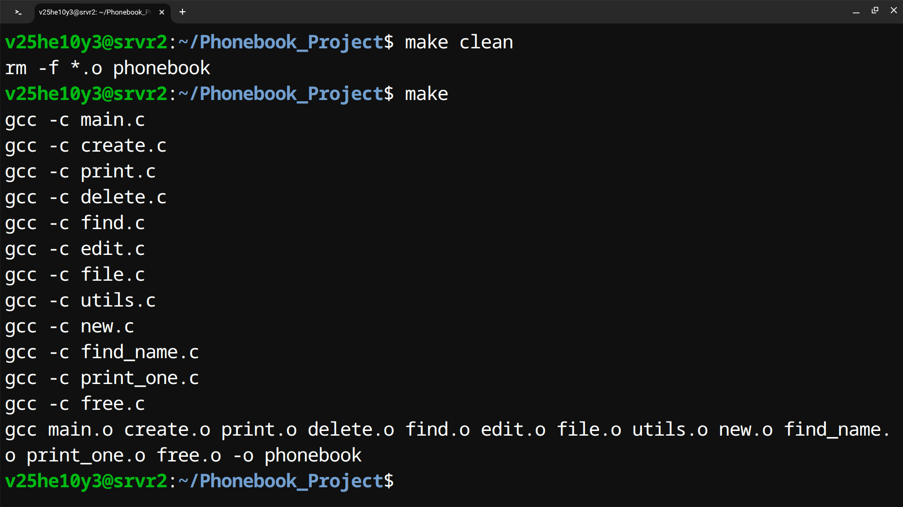
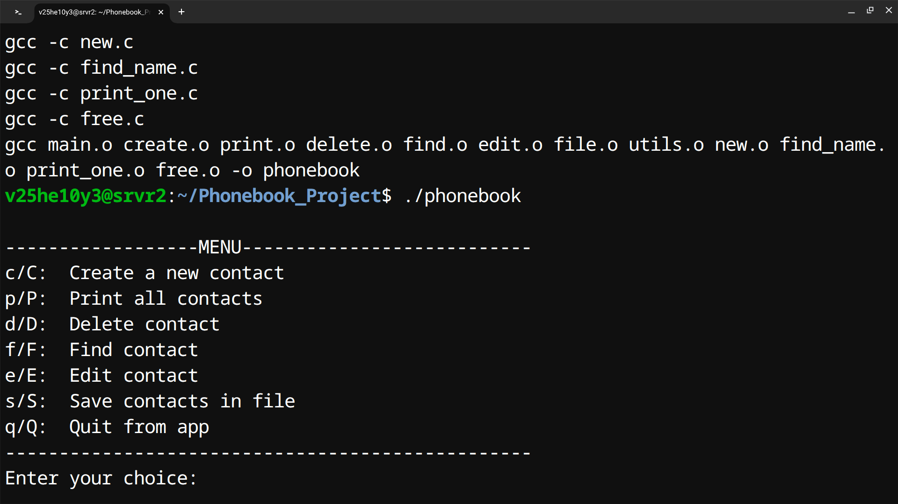
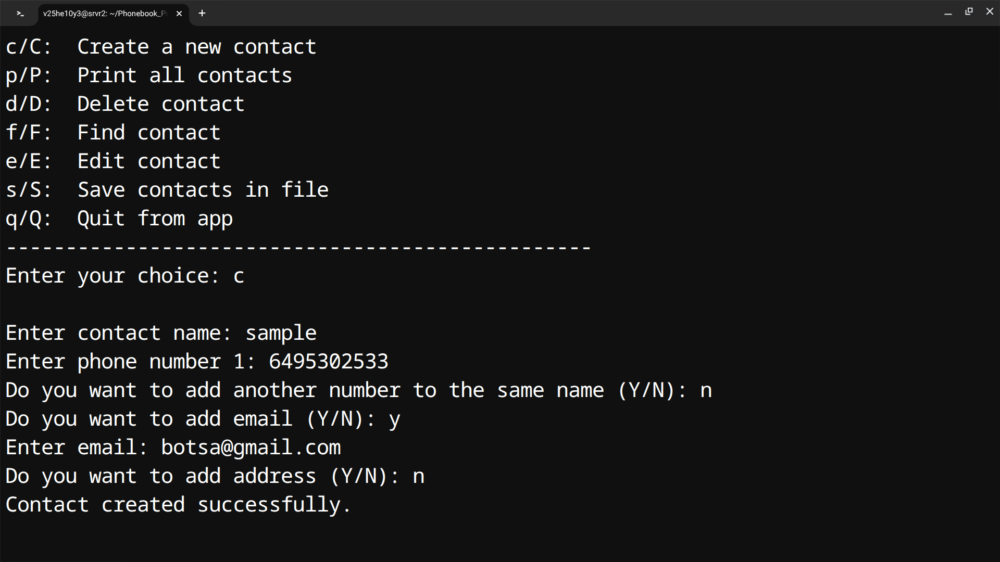
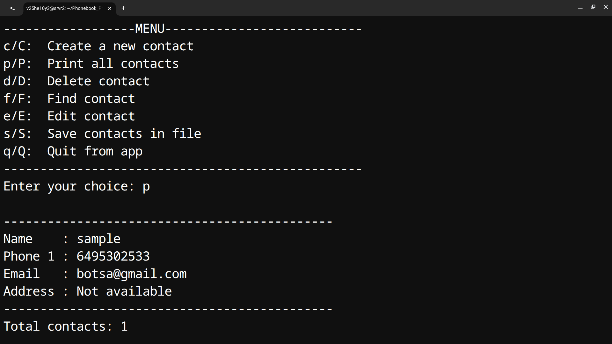

# C - Phone Book Application

A menu-driven Phone Book Management System developed in C using a Singly Linked List and File Handling.

## Features

- Create a new contact
- Store multiple phone numbers for one contact
- Store email address
- Store address
- Display all contacts
- Find a contact by name
- Edit contact details
- Delete a contact
- Prevent duplicate contact names
- Save contacts to a file
- Load contacts automatically when the application starts
- Dynamic memory allocation
- Singly linked list implementation
- Modular programming using multiple C source files
- Makefile for compilation


## Screenshots

### Make Compilation




### Main Menu




### Creating a Contact




### Displaying Contacts




## Menu

```text
------------------MENU---------------------------
c/C:  Create a new contact
p/P:  Print all contacts
d/D:  Delete contact
f/F:  Find contact
e/E:  Edit contact
s/S:  Save contacts in file
q/Q:  Quit from app
-------------------------------------------------
```

## Technologies Used

- C Programming
- Singly Linked List
- Structures
- Pointers
- Dynamic Memory Allocation
- File Handling
- Modular Programming
- Makefile
- GCC Compiler

## Project Structure

```text
C-PhoneBook-Management-System/
│
├── main.c
├── phonebook.h
├── create.c
├── print.c
├── delete.c
├── find.c
├── find_name.c
├── print_one.c
├── edit.c
├── new.c
├── file.c
├── free.c
├── utils.c
├── Makefile
├── README.md
└── .gitignore
```

## Description of Source Files

| File | Description |
|------|-------------|
| `main.c` | Main program and menu handling |
| `phonebook.h` | Structures, constants and function declarations |
| `create.c` | Creates a new contact |
| `print.c` | Displays all contacts |
| `delete.c` | Deletes a contact |
| `find.c` | Finds a contact |
| `find_name.c` | Searches contacts by name |
| `print_one.c` | Displays a single contact |
| `edit.c` | Edits contact information |
| `new.c` | Allocates memory for a new contact |
| `file.c` | Saves and loads contacts using file handling |
| `free.c` | Frees allocated linked-list memory |
| `utils.c` | Input handling and utility functions |
| `Makefile` | Compiles and links the project |

## Contact Information

Each contact contains:

- Name
- Phone Number(s)
- Email
- Address

A contact can contain multiple phone numbers, with a maximum of 5 phone numbers.

## Data Structure

The project uses a Singly Linked List.

Each node contains the contact information and a pointer to the next contact.

```text
+----------------------+      +----------------------+      +----------------------+
| Contact              |      | Contact              |      | Contact              |
|----------------------|      |----------------------|      |----------------------|
| Name                 |      | Name                 |      | Name                 |
| Phone Numbers        |      | Phone Numbers        |      | Phone Numbers        |
| Email                |      | Email                |      | Email                |
| Address              |      | Address              |      | Address              |
| next ----------------|----->| next ----------------|----->| next -> NULL          |
+----------------------+      +----------------------+      +----------------------+
```

## File Handling

Contact information is stored in:

```text
phonebook.dat
```

The application:

1. Loads existing contacts when it starts.
2. Allows the user to modify the contact list.
3. Saves contacts when the user selects the save option.
4. Saves contacts automatically when quitting the application.

The linked-list pointer is not stored in the file. The contact data is written and the linked list is reconstructed when the application starts.

## Compilation

Make sure GCC and Make are installed.

Compile the project using:

```bash
make
```

This creates the executable:

```text
phonebook
```

## Run the Application

```bash
./phonebook
```

## Clean Build Files

To remove object files and the executable:

```bash
make clean
```

## Example

Creating a contact:

```text
Enter contact name: sample
Enter phone number 1: 6495302533
Do you want to add another number to the same name (Y/N): n
Do you want to add email (Y/N): y
Enter email: botsa@gmail.com
Do you want to add address (Y/N): n

Contact created successfully.
```

Displaying the contact:

```text
---------------------------------------------
Name    : sample
Phone 1 : 6495302533
Email   : botsa@gmail.com
Address : Not Available
---------------------------------------------
```

## Learning Outcomes

This project demonstrates practical implementation of:

- Structures in C
- Pointers
- Singly Linked Lists
- Dynamic Memory Allocation
- String Handling
- File Handling
- Modular C Programming
- Header Files
- Makefile
- CRUD operations
- Persistent data storage

## Author

**Yeshwanth Botsa**

B.Tech - Electronics and Communication Engineering

## License

This project is created for educational and training purposes.
